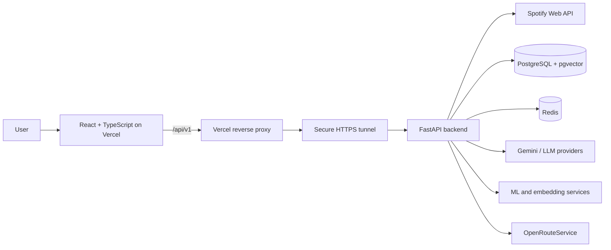

# VibeRoute AI

<div align="center">

### AI-powered music discovery, playlist generation, taste intelligence, and route-aware listening

[](https://react.dev/)
[](https://www.typescriptlang.org/)
[](https://fastapi.tiangolo.com/)
[](https://developer.spotify.com/)
[](https://vercel.com/)

[Live Application](https://viberoute-ai.vercel.app) •
[API Health](https://viberoute-ai.vercel.app/api/v1/health) •
[Report an Issue](https://github.com/eddytiya/viberoute-ai/issues)

</div>

---

## Overview

**VibeRoute AI** is a full-stack music intelligence platform that transforms Spotify listening data into personalized recommendations, AI-generated playlists, taste insights, sound maps, skip predictions, and route-aware listening experiences.

Instead of functioning as another Spotify client, VibeRoute treats listening history as a rich behavioral signal. It combines Spotify data, semantic embeddings, machine-learning workflows, geospatial routing, and generative AI to help users understand and expand their musical identity.

> **Deployment notice:** The React frontend is continuously deployed on Vercel. The ML-enabled FastAPI backend is securely hosted locally and activated on demand, preserving the complete ML functionality without requiring paid cloud infrastructure.

## Product Preview

### Personalized Dashboard


### AI Playlist Architect


### Recommendations and Taste Insights


### Sound Map and Route Playlist


## Key Features

| Feature | Description |
|---|---|
| **Spotify OAuth** | Securely connects Spotify accounts and retrieves profile and listening information. |
| **Personal Dashboard** | Displays top tracks, artists, recent activity, and account-level insights. |
| **Playlist Architect** | Builds playlists from natural-language intent, mood, duration, and listening preferences. |
| **Hybrid Recommendations** | Combines listening history, content similarity, embeddings, and preference signals. |
| **Music Critic** | Uses generative AI to produce structured musical analysis and commentary. |
| **Taste Insights** | Identifies recurring artists, diversity, listening patterns, and taste characteristics. |
| **Sound Map** | Projects track embeddings into a clustered two-dimensional map of the user’s music taste. |
| **Route Playlist** | Creates playlists based on journey duration and route information. |
| **Skip Predictor** | Estimates the probability that a listener will skip a track. |
| **Playlist Management** | Creates, inspects, and manages Spotify playlists from a unified interface. |

## Architecture



### Request Flow

1. The user opens the React application deployed on Vercel.
2. Frontend requests use the same-origin `/api/v1` path.
3. Vercel proxies API traffic through a secure HTTPS tunnel.
4. The tunnel forwards requests to the locally hosted FastAPI backend.
5. FastAPI coordinates Spotify, persistence, AI, recommendation, and routing services.
6. OAuth callbacks return through the Vercel domain for a consistent user-facing origin.

## Technology Stack

### Frontend

- React 19
- TypeScript
- Vite
- React Router
- TanStack Query
- Zustand
- Axios
- React Hook Form
- Zod
- Framer Motion
- Recharts
- Lucide Icons

### Backend

- Python 3.12
- FastAPI
- Uvicorn
- Pydantic Settings
- SQLAlchemy
- Alembic
- PostgreSQL
- pgvector
- Redis
- Spotipy
- Celery-ready infrastructure

### AI and Machine Learning

- Google Gemini
- Optional OpenAI and Anthropic support
- PyTorch
- Sentence Transformers
- Transformers
- NumPy
- pandas
- SciPy
- scikit-learn
- XGBoost

### External Integrations

- Spotify Web API
- OpenRouteService
- Google Maps-ready configuration
- Vercel
- Tailscale Funnel

## Repository Structure

```text
viberoute-ai/
├── backend/
│   ├── alembic/                 # Database migrations
│   ├── app/
│   │   ├── api/                 # FastAPI routes and dependencies
│   │   ├── core/                # Configuration and security
│   │   ├── db/                  # Database setup
│   │   ├── models/              # SQLAlchemy models
│   │   ├── repositories/        # Persistence layer
│   │   ├── schemas/             # API contracts
│   │   └── services/            # Spotify, AI, ML, and route logic
│   ├── requirements.txt
│   └── alembic.ini
├── frontend/
│   ├── public/
│   ├── src/
│   │   ├── api/                 # Typed API clients
│   │   ├── components/          # UI and feature components
│   │   ├── hooks/               # React hooks
│   │   ├── layouts/             # Application layouts
│   │   ├── pages/               # Route-level pages
│   │   ├── routes/              # Router configuration
│   │   ├── store/               # Zustand stores
│   │   ├── types/               # TypeScript domain types
│   │   └── utils/               # Shared utilities
│   ├── vercel.json
│   └── package.json
├── tests/
├── data/
├── docs/
├── infrastructure/
├── ml/
└── scripts/
```

## Local Development

### Prerequisites

- Python 3.12
- Node.js 20 or newer
- PostgreSQL
- Redis, if cache or background features are enabled
- Spotify Developer application
- Gemini API key
- OpenRouteService API key

### 1. Clone the Repository

```bash
git clone https://github.com/eddytiya/viberoute-ai.git
cd viberoute-ai
```

### 2. Configure the Backend

#### Windows

```cmd
cd backend
python -m venv .venv
.venv\Scripts\activate
python -m pip install --upgrade pip
pip install -r requirements.txt
copy .env.example .env
```

#### macOS or Linux

```bash
cd backend
python3 -m venv .venv
source .venv/bin/activate
python -m pip install --upgrade pip
pip install -r requirements.txt
cp .env.example .env
```

Populate `backend/.env` with your own credentials:

```env
ENVIRONMENT=development
FRONTEND_URL=http://127.0.0.1:5173

SESSION_SECRET_KEY=replace-with-a-long-random-secret

SPOTIFY_CLIENT_ID=your-client-id
SPOTIFY_CLIENT_SECRET=your-client-secret
SPOTIFY_REDIRECT_URI=http://127.0.0.1:8000/api/v1/auth/callback

GEMINI_API_KEY=your-gemini-key
GEMINI_MODEL=gemini-2.5-flash

OPENROUTE_API_KEY=your-openroute-key

DATABASE_URL=your-postgresql-url
REDIS_URL=your-redis-url
```

Generate a secure session key:

```bash
python -c "import secrets; print(secrets.token_hex(32))"
```

Never commit `.env` files.

### 3. Apply Database Migrations

```bash
cd backend
alembic upgrade head
```

### 4. Start the API

```bash
uvicorn app.main:app --host 127.0.0.1 --port 8000 --reload
```

Local backend URLs:

- Health: `http://127.0.0.1:8000/api/v1/health`
- Swagger UI: `http://127.0.0.1:8000/docs`
- OpenAPI: `http://127.0.0.1:8000/openapi.json`

### 5. Configure the Frontend

```bash
cd frontend
npm install
```

Create `frontend/.env`:

```env
VITE_API_BASE_URL=http://127.0.0.1:8000/api/v1
```

Start the frontend:

```bash
npm run dev
```

Open:

```text
http://127.0.0.1:5173
```

## Spotify OAuth Configuration

1. Open the [Spotify Developer Dashboard](https://developer.spotify.com/dashboard).
2. Create or select an application.
3. Copy its Client ID and Client Secret into `backend/.env`.
4. Add the local callback:

```text
http://127.0.0.1:8000/api/v1/auth/callback
```

5. For the deployed frontend, add:

```text
https://viberoute-ai.vercel.app/api/v1/auth/callback
```

Spotify redirect URIs must match the configured application value exactly.

## API Overview

The backend provides 47 documented API paths.

| Prefix | Responsibility |
|---|---|
| `/api/v1/health` | Service health |
| `/api/v1/auth` | Spotify OAuth, session state, and logout |
| `/api/v1/spotify` | Spotify account and catalog operations |
| `/api/v1/playlists` | Playlist creation and management |
| `/api/v1/recommendations` | Personalized recommendation workflows |
| `/api/v1/insights` | Taste analysis and sound-map data |
| `/api/v1/music-critic` | AI-assisted music analysis |
| `/api/v1/skip-predictor` | Skip-probability estimation |
| `/api/v1/routes` | Route-aware playlist generation |

Use Swagger UI at `/docs` for the complete API contract.

## Testing

Run backend tests:

```bash
pytest
```

Run frontend checks:

```bash
cd frontend
npm run lint
npm run build
```

Run basic smoke tests:

```bash
curl http://127.0.0.1:8000/api/v1/health
curl https://viberoute-ai.vercel.app/api/v1/health
```

Expected result:

```json
{"status":"ok"}
```

## Deployment

### Frontend

The `frontend` directory is deployed on Vercel with:

```text
Build command: npm run build
Output directory: dist
Environment variable: VITE_API_BASE_URL=/api/v1
```

SPA and API rewrites are configured in `frontend/vercel.json`.

### Backend

The backend contains memory-intensive ML and embedding libraries. Observed usage is approximately:

- 500–600 MB resident memory after startup and normal use
- Approximately 1 GB private memory allocation
- Higher temporary usage while loading or executing ML models

A continuous cloud deployment should provide at least **2 GB RAM**.

The current portfolio deployment runs the backend locally on demand and exposes it through a secure HTTPS tunnel. This preserves the complete functionality without requiring paid infrastructure.

## Starting the Portfolio Deployment

Start Tailscale:

```cmd
net start Tailscale
```

Start FastAPI:

```cmd
cd /d D:\PROJECTS\viberoute-ai\backend
.venv\Scripts\activate
uvicorn app.main:app --host 127.0.0.1 --port 8001
```

In another Administrator terminal, start the tunnel:

```cmd
"C:\Program Files\Tailscale\tailscale.exe" funnel 8001
```

Verify:

```cmd
curl http://127.0.0.1:8001/api/v1/health
curl https://viberoute-ai.vercel.app/api/v1/health
```

## Security

- Spotify OAuth callbacks use state validation.
- Session and OAuth cookies are HTTP-only.
- Secrets are loaded through environment variables.
- The frontend communicates through a same-origin API rewrite.
- `.env` files and virtual environments are excluded from Git.
- Credentials should be rotated immediately if exposed.
- Spotify secrets, database URLs, session keys, and AI keys must never be committed.

## Roadmap

- [ ] Add automated end-to-end browser tests
- [ ] Add route-level frontend code splitting
- [ ] Introduce background playlist-generation jobs
- [ ] Add recommendation and model evaluation dashboards
- [ ] Support collaborative playlist sessions
- [ ] Add mobile-first playback controls
- [ ] Containerize the backend
- [ ] Add API latency and Spotify rate-limit monitoring

## Contributing

Contributions and constructive feedback are welcome.

1. Fork the repository.
2. Create a feature branch:

```bash
git checkout -b feature/your-feature
```

3. Commit your changes.
4. Push the branch.
5. Open a pull request.

## Acknowledgements

- [Spotify for Developers](https://developer.spotify.com/)
- [FastAPI](https://fastapi.tiangolo.com/)
- [Google AI Studio](https://aistudio.google.com/)
- [OpenRouteService](https://openrouteservice.org/)
- The React, Python, data-science, and machine-learning communities

---

<div align="center">

Built by [Aditya Pathak](https://github.com/eddytiya)

If you find this project useful, consider giving it a star.

</div>
